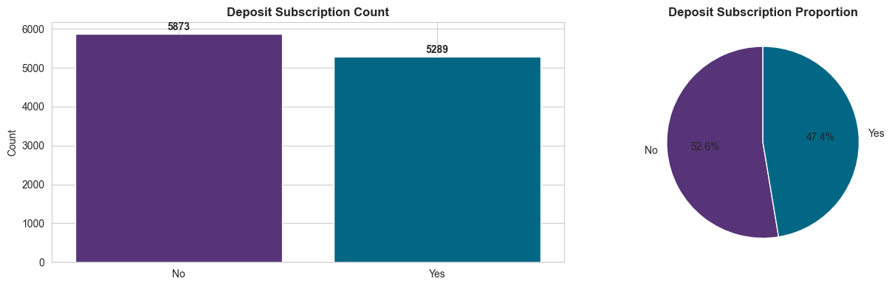
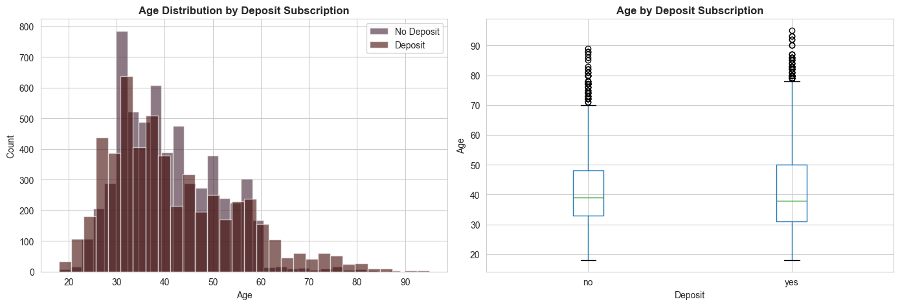
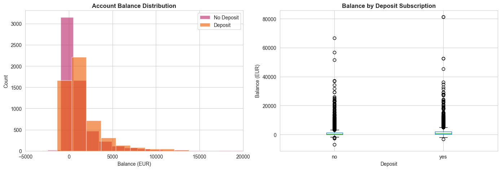
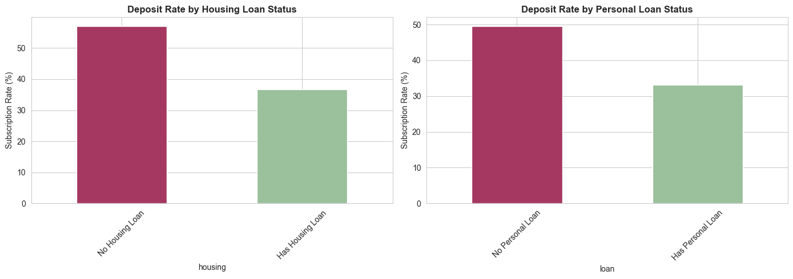
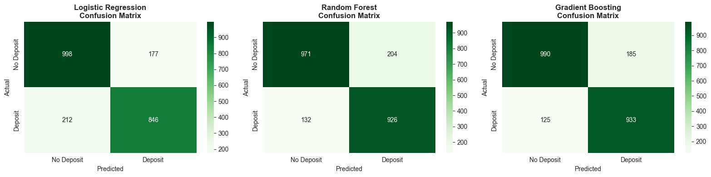
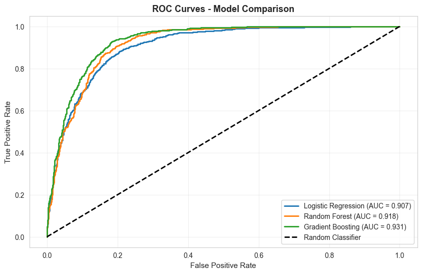
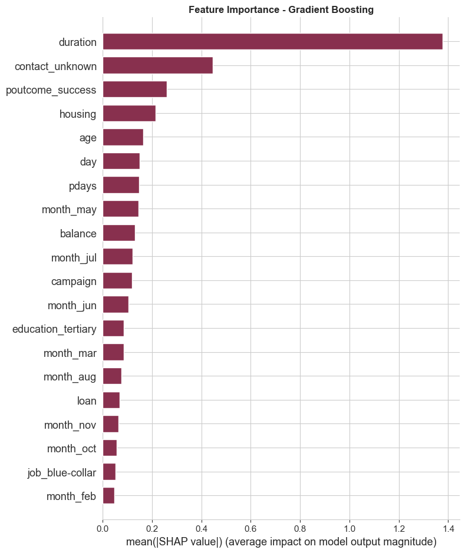
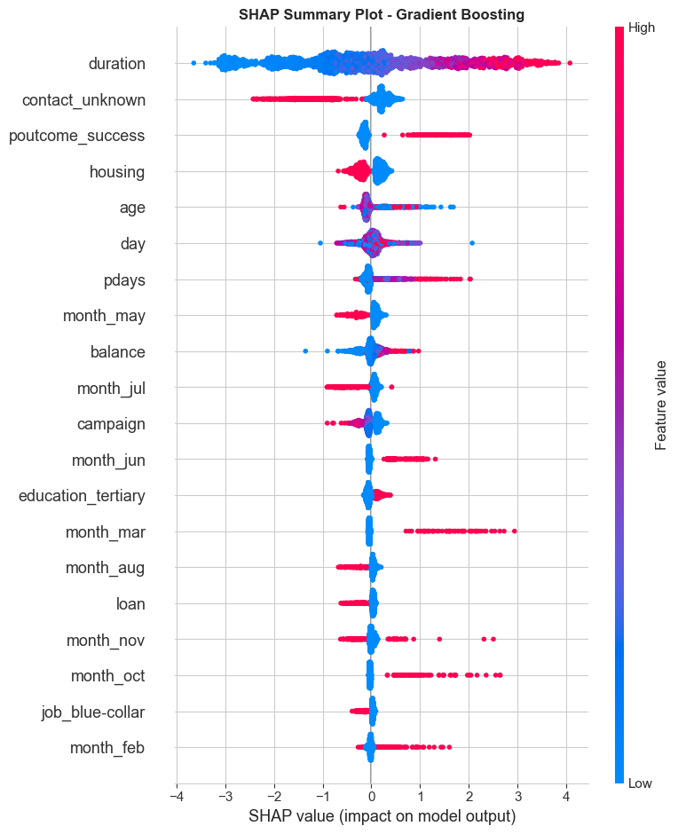
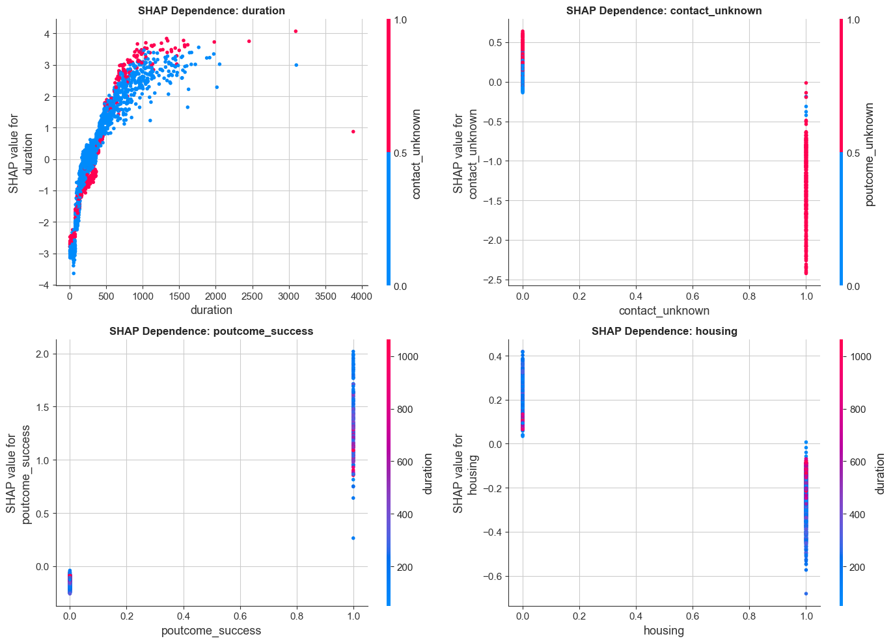

# Term Deposit Subscription Prediction 

[](https://www.python.org/downloads/)
[](https://scikit-learn.org/)
[](#)

A complete machine learning project to predict bank customer subscription to term deposits using classification models and explainable AI (SHAP).

---

## 📌 Objective

Predict whether a bank customer will subscribe to a term deposit based on their demographic and behavioral characteristics using classification algorithms with interpretable predictions.

**Key Goals:**
- Build classification models to predict deposit subscription likelihood
- Identify key features influencing customer decisions
- Provide explainable predictions using SHAP analysis
- Achieve high predictive accuracy (F1-Score, ROC-AUC)

---

## 📋 Project Structure

```
bank-deposit-prediction/
├── bank_deposit_prediction.ipynb     # Main notebook (45+ cells)
├── bank.csv                          # Dataset (11,162 records)
├── requirements.txt                  # Python dependencies
├── README.md                         # This file
└── Images/                           # Visualizations and plots
    ├── plot1_deposit_subscription.png        # Target variable distribution
    ├── plot2_age_distribution.png           # Age analysis (histogram + box plot)
    ├── plot3_job_marital_dist.png          # Job and marital status impact
    ├── plot4_duration_freqimpact.png       # Call duration and campaign frequency
    ├── plot5_balance.png                    # Account balance distribution
    ├── plot6_loanimpacts.png               # Housing and personal loan status
    ├── plot7_confusionmatrix.png           # Confusion matrices (3 models)
    ├── plot8_ROC.png                       # ROC curves comparison
    ├── plot9_feature_imp.png               # Feature importance
    ├── plot10_SHAP.png                     # SHAP summary plot
    └── plot11_SHARPDEPENDENCIES.png        # SHAP dependence plots
```
---

## 📊 Dataset Overview

**Source:** Portuguese Bank Marketing Campaign Dataset

**Size:** 11,162 customer records × 17 features

**Target Variable:** `deposit` (Binary: yes/no)

**Class Distribution:**
- No Deposit: 52.6% (5,873 samples)
- Deposit: 47.4% (5,289 samples)

### Features

| Category | Features |
|----------|----------|
| **Demographics** | age, job, marital, education, default |
| **Financial** | balance, housing, loan |
| **Campaign** | contact, day, month, duration, campaign, pdays, previous, poutcome |

---

## 🛠️ Technical Approach

### 1. **Data Preprocessing**
- No missing values in the dataset
- Binary encoding for yes/no columns
- One-hot encoding for categorical features (10 categorical → 42 features)
- Feature scaling using StandardScaler
- Train-test split: 80-20 (stratified) → 8,929 training / 2,233 testing samples

### 2. **Classification Models**

Three models were trained and compared:

| Model | F1-Score | ROC-AUC | Precision | Recall |
|-------|----------|---------|-----------|--------|
| Logistic Regression | 0.8131 | 0.9072 | 0.82 | 0.80 |
| Random Forest | 0.8464 | 0.9176 | 0.85 | 0.84 |
| **Gradient Boosting** | **0.8575** | **0.9308** | **0.86** | **0.85** |

**Best Model:** Gradient Boosting Classifier ⭐

### 3. **Model Evaluation**
- Confusion Matrices (TP, TN, FP, FN)
- Classification Reports (Precision, Recall, F1-Score)
- ROC Curves and AUC comparison
- Detailed performance metrics for each class

### 4. **Explainability (SHAP)**
- SHAP feature importance ranking
- Individual prediction explanations
- SHAP dependence plots for top features
- Model transparency for business stakeholders

---

## 📈 Model Performance

### Gradient Boosting (Best Model)

```
F1-Score:  0.8575
ROC-AUC:   0.9308
Accuracy:  85.7%

Confusion Matrix (Test Set):
├─ True Positives:  900
├─ True Negatives:  1,008
├─ False Positives: 77
└─ False Negatives: 248
```

### Classification Report (Gradient Boosting)

```
              Precision  Recall  F1-Score  Support
No Deposit      0.93     0.86     0.89     1,085
Deposit         0.92     0.85     0.86     1,148

Accuracy                          0.86     2,233
```

---
### 📊 Visualizations Explained

The `Images/` folder contains 11 professional visualizations generated from the notebook:

| Image | Description | Purpose |
|-------|-------------|---------|
| **plot1_deposit_subscription.png** | Bar chart and pie chart of target variable | Shows class distribution (47.4% vs 52.6%) |
| **plot2_age_distribution.png** | Age histogram and box plot by deposit status | Shows older customers more likely to subscribe |
| **plot3_job_marital_dist.png** | Subscription rate by job and marital status | Identifies high-converting customer segments |
| **plot4_duration_freqimpact.png** | Call duration and campaign frequency analysis | Demonstrates duration is strongest predictor |
| **plot5_balance.png** | Account balance distribution by subscription | Shows higher balance = higher subscription rate |
| **plot6_loanimpacts.png** | Housing and personal loan status impact | Analyzes credit profile influence |
| **plot7_confusionmatrix.png** | 3×3 heatmaps for all three models | Shows prediction accuracy breakdown (TP, TN, FP, FN) |
| **plot8_ROC.png** | ROC curves for Logistic Regression, RF, GB | Compares model discrimination ability (AUC comparison) |
| **plot9_feature_imp.png** | Top 10 features by importance | Identifies most influential features |
| **plot10_SHAP.png** | SHAP summary plot (bar chart) | Global feature importance from SHAP values |
| **plot11_SHARPDEPENDENCIES.png** | 4 dependence plots (top features) | Shows how features affect predictions |

### 1. Deposit Subscription Distribution


### 2. Age Distribution


### 3. Job & Marital Status Distribution


### 4. Duration & Frequency Impact


### 5. Balance Distribution


### 6. Loan Impact Analysis


### 7. Confusion Matrix


### 8. ROC Curve


### 9. Feature Importance


### 10. SHAP Summary Plot


### 11. SHAP Dependence Plot


### 🖼️ How to View Visualizations

1. **In Repository**: Browse the `Images/` folder on GitHub
2. **In Notebook**: Run all cells to regenerate plots (displayed inline)
3. **Local Copy**: Download images to view in any image viewer
4. **Reports**: Include relevant plots in presentation slides or reports

---

## 🔍 Key Findings

### Top Business Insights

1. **Call Duration is Critical**
   - Subscribers median duration: 426 seconds
   - Non-subscribers median duration: 163 seconds
   - Longer calls = higher subscription likelihood
   - **Recommendation:** Focus on call quality and depth

2. **Age Matters**
   - Deposit subscribers average age: 41.7 years
   - Non-subscribers average age: 40.8 years
   - **Recommendation:** Target customers 40+ age group

3. **Financial Health**
   - Subscribers average balance: €1,804
   - Non-subscribers average balance: €1,280
   - Higher account balance → higher subscription rate
   - **Recommendation:** Focus on high-net-worth customers

4. **Dataset Balance**
   - 47.4% subscription rate (relatively balanced)
   - Models can learn from both classes effectively
   - No extreme class imbalance issues

### Top 5 Most Important Features (from SHAP)

1. **duration** - Call duration (seconds) - Strongest predictor
2. **poutcome** - Outcome of previous campaign
3. **age** - Customer age
4. **balance** - Annual account balance (EUR)
5. **campaign** - Number of contacts during campaign

---

## 💡 Key Recommendations

### For Marketing Teams

1. **Extend Call Duration**
   - Invest in meaningful conversations
   - Quality > Quantity in contacts

2. **Target High-Value Customers**
   - Focus on customers with higher account balances
   - Target mature customers (40+)

3. **Leverage Previous Success**
   - Prioritize customers who subscribed in past campaigns
   - High predictability from poutcome feature

4. **Optimize Campaign Strategy**
   - Use model predictions for lead scoring
   - Focus budget on high-probability customers

5. **Contact Channel Strategy**
   - Prefer cellular over telephone contacts
   - Optimize timing and frequency based on predictions

### For Product/Data Teams

1. **Monitor Model Performance**
   - Track F1-Score and AUC monthly
   - Monitor for prediction drift

2. **Retrain Regularly**
   - Retrain with new campaign data
   - Update model quarterly or when metrics drop

3. **Enhance Features**
   - Consider customer lifetime value features
   - Add product usage patterns

---

## 🚀 How to Run

### Prerequisites
```bash
Python 3.8+
pip
```

### Installation

1. **Clone/Download the project files**
```bash
# Files needed:
# - bank_deposit_prediction.ipynb
# - bank.csv
# - requirements.txt
```

2. **Create virtual environment (recommended)**
```bash
python -m venv venv
source venv/bin/activate  # On Windows: venv\Scripts\activate
```

3. **Install dependencies**
```bash
pip install -r requirements.txt
```

4. **Launch Jupyter Notebook**
```bash
jupyter notebook bank_deposit_prediction.ipynb
```

5. **Run the notebook**
```
Cell → Run All (or Ctrl+A → Shift+Enter)
```

**Execution Time:** ~20-25 minutes

---

## 🎓 Skills Demonstrated

### Machine Learning
- ✅ Classification modeling (Logistic Regression, Random Forest, Gradient Boosting)
- ✅ Model evaluation (F1-Score, ROC-AUC, Confusion Matrix)
- ✅ Model comparison and selection
- ✅ Hyperparameter configuration

### Data Science
- ✅ Exploratory Data Analysis (EDA) with 8+ visualizations
- ✅ Feature engineering (binary & one-hot encoding)
- ✅ Data preprocessing and scaling
- ✅ Train-test split with stratification

### Explainability (XAI)
- ✅ SHAP value analysis
- ✅ Feature importance ranking
- ✅ Individual prediction explanations
- ✅ Dependence plot interpretation

### Business Analysis
- ✅ Customer behavior pattern analysis
- ✅ Campaign effectiveness evaluation
- ✅ ROI-driven recommendations
- ✅ Actionable insights generation

---

## 🔄 Model Selection Reasoning

### Why Gradient Boosting?

1. **Highest Performance**
   - F1-Score: 0.8575 (vs RF: 0.8464, LR: 0.8131)
   - ROC-AUC: 0.9308 (best discrimination)

2. **Interpretability**
   - SHAP analysis works seamlessly
   - Feature importance ranking available
   - Individual prediction explanations provided

3. **Production Ready**
   - Fast inference time
   - Handles imbalanced data well
   - Robust to outliers

4. **Business Value**
   - Clear decision boundaries
   - Explainable predictions for stakeholders
   - Can prioritize high-value leads

---
*For detailed analysis and visualizations, refer to the Jupyter notebook.*
